# Vue Drip Button 
 [](https://www.npmjs.com/package/@arikardnoir/vue-drip-button) <a href="https://www.npmjs.com/package/@arikardnoir/vue-drip-button"> [](LICENSE)
> A Vue.js plugin to easily integrate button in your projects.

Vue Drip Button is a simple button that give a lot of alternatives to work with, instead of using a predefined button.


## Instalation
Install the package from npm by running:
``` bash
# install dependencies
npm i @arikardnoir/vue-drip-button
```

## Usage
Import, register and place the component in your Vue app.
```html
<template>
  <VueDripButton />
</template>
```

```html
import VueDripButton from 'vue-drip-button'

export default {
  components: {
    VueDripButton,
  }
}
```

## Accessibility
Apply attributes, directly on the element to apply them to the button.
```html
<template>
  <VueDripButton
    classType="button success"
    text="New Product"
    :needSpinner="true"
    :isRequesting="true"
  />
</template>
```

## Props
Components Property that make him cool

|Name              |Type          |Default           |Description                                           |
|------------------|--------------|------------------|------------------------------------------------------|
|classType         |String        |button success    |This prop allow to change button color,according to our terms
|text              |String        |                  |This prop allow you to change the button text
|needSpinner       |Boolean       |false             |With this prop you make choice if you want to use spinner on this button
|isRequesting      |Boolean       |false             |This prop make sense if you will use the Spinner, i could help your button spinner work if the two are in TRUE mode.
|isDisabled        |Boolean       |false             |This prop is for disable your button


## Button Colour Styles
Component classType for change the Style

|classType                 |Type              |Image                                      |
|--------------------------|------------------|-------------------------------------------|
|primary                   |String            |   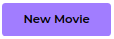           |
|secondary                 |String            |   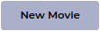         |
|warning                   |String            |   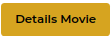           |
|danger                    |String            |   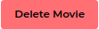            |
|success                   |String (default)  |   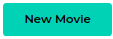           |
|info                      |String            |   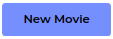              |
|primary-outline           |String            |   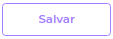   |
|secondary-outline         |String            |   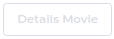 |
|warning-outline           |String            |   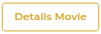   |
|danger-outline            |String            |   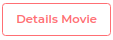    |
|success-outline           |String            |   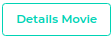   |
|info-outline              |String            |   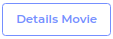      |
